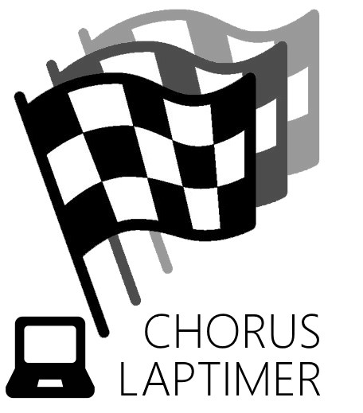
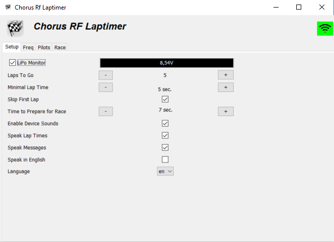
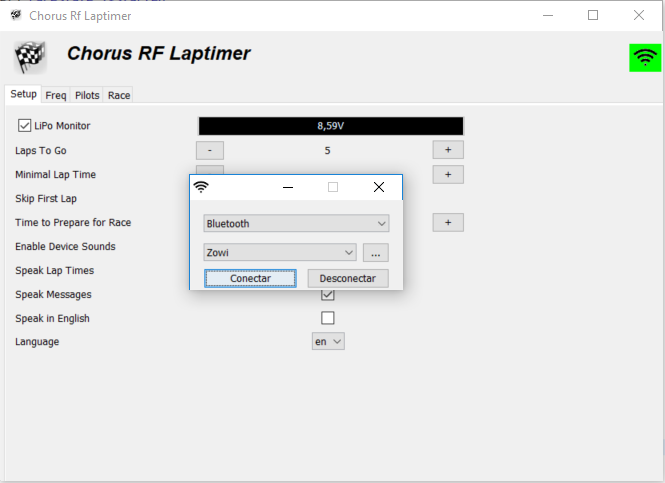
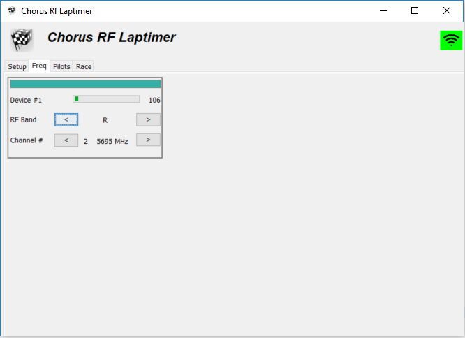
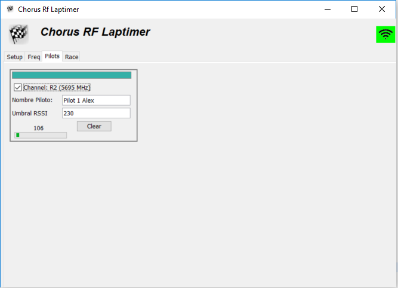
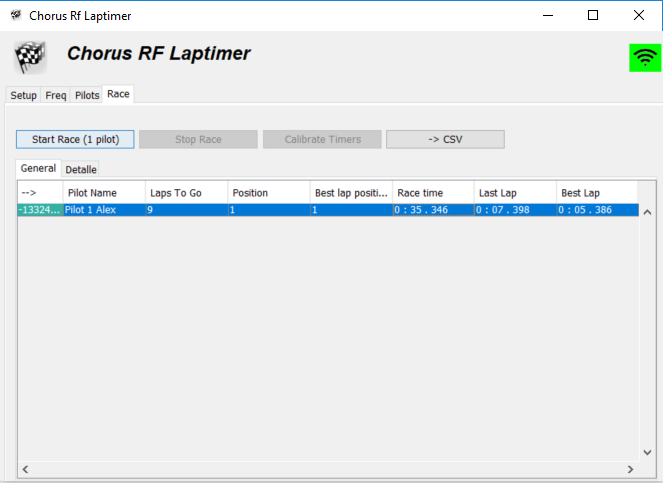
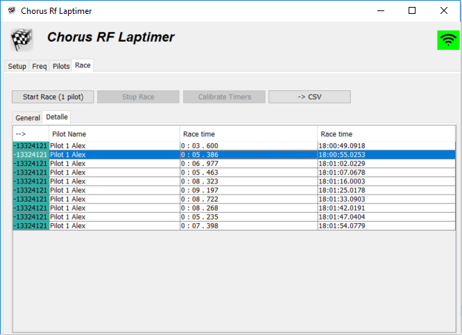

# Chorus RF Laptimer PC

 
 
 
 
Chorus RF Laptimer PC
  Es una iniciativa con el objetivo de tener una aplicación de escritorio
  que funcione en diferentes sistemas operativos.
 
 
 
 
 

## Referencias

- [Voroshkov - Chorus-RF-Laptimer](https://github.com/voroshkov/Chorus-RF-Laptimer) - https://github.com/voroshkov/Chorus-RF-Laptimer

## Caracteristicas

- Funcionalidad y lógica similar a Chorus RF Laptimer.
- Configuración principal
- Configuración de frecuencias
- Configuración de piloto
- Sección de carreras
  - En la primera version se da soporte a Bluetooth.
- Para velocidad en conexión se guarda la configuración de la ultima conexion.

## Requerimientos

- Windows
- Java 1.8
- Computador con Bluetooth.

## Descarga

- [ChorusRfLaptimer_v1.0_BETA](versions/ChorusRfLaptimer_v1.0_BETA.zip)

## Hoja de ruta - Proximas funciones

- Mejoras esteticas.
- Sonidos
- Soporte a WIFI (DT-06)
- Protocolo de integración (WS-REST, Otros software de lap timer.) 
- Soporte en Linux y MAC OS

## Captura de pantalla

Configuratación

Conexión

Frecuencia

Piloto

Resultado Carrera General

Resultado Carrera Detallada

## Contactos

- https://www.facebook.com/alexander.rios.7549
